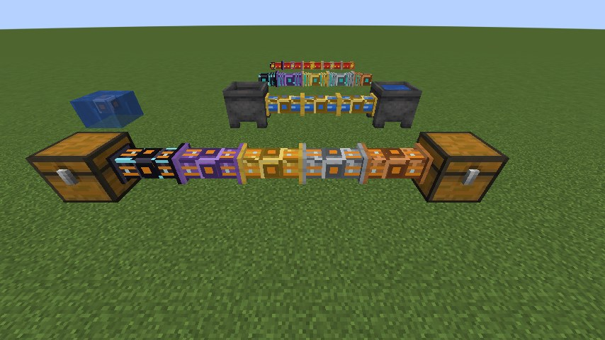

<p align="center">
  
</p>

<h1 align="center">Pipster</h1>

<p align="center">
  Readable item, fluid, gas and energy pipes for Minecraft, with filters right at the port<br>
  and channel-based tesseracts. For Fabric and NeoForge.
</p>

<p align="center">
  <a href="#version-status">Versions</a> ·
  <a href="../../wiki">Wiki</a> ·
  <a href="#building-from-source">Building</a> ·
  <a href="#license">License</a>
</p>

> **Status: pre-release.** Pipster has not been published yet. The versions listed under
> [Version status](#version-status) are built, started and tested automatically, but there is
> no release build yet. Expect changes to balance values and save data before 1.0.



## What Pipster is

Pipster is a transport mod that tries to stay easy to read. Every resource type has its own
pipe, every pipe looks like a pipe (no full blocks), and everything you configure lives
directly at the port where the pipe meets a machine.

* **Four transport kinds:** item pipes, fluid pipes, gas pipes and energy cables. Different
  kinds never connect to each other.
* **Five tiers:** Copper, Reinforced, Precision, Resonant and Quantum. Upgrade pipes in place
  with an upgrade bolt; the pipe keeps its settings and contents.
* **Configure ports with the Conduit Wrench:** mode (insert, extract, both, off), redstone
  control, priority, distribution (round robin, nearest first, sticky) and copy/paste profiles.
* **Filter cards instead of filter blocks:** put a card into the port itself. Basic (9 rules),
  Advanced (27 rules: tags, mod namespace, components) and Precision (54 rules: also "keep N in
  the source" and "fill the target up to N"). The Rule Card adds port rate limits and an energy
  reserve.
* **Tesseracts:** send resources through named channels. The Resonant Tesseract works over any
  distance in the same dimension. The Quantum Tesseract works across all dimensions of a
  server. Channels are private, invite-only or public.
* **Honest throughput:** every pipe segment has one shared per-tick budget. A single Copper
  segment limits a whole path, even between Quantum ports. There is no creative tier that
  ignores limits.

## Tiers

Rates are per pipe segment and tick, shared by all transfers through that segment. They are
balance values, not measured results.

| Tier | Items/t | Fluid mB/t | Gas units/t | Energy E/t | Item batch |
|---|---:|---:|---:|---:|---:|
| T1 Copper | 2 | 100 | 100 | 1,000 | 8 |
| T2 Reinforced | 8 | 400 | 400 | 8,000 | 32 |
| T3 Precision | 32 | 1,600 | 1,600 | 64,000 | 64 |
| T4 Resonant | 128 | 6,400 | 6,400 | 512,000 | 256 |
| T5 Quantum | 512 | 25,600 | 25,600 | 4,096,000 | 1,024 |

## Works with other mods

Pipster talks to other mods only through the standard interfaces of each loader. It has
no hard dependency on any content mod.

| Resource | Fabric | NeoForge |
|---|---|---|
| Items | Fabric Transfer API (`ItemStorage`) | item handler capability (`IItemHandler`; `ResourceHandler` from 21.9 on) |
| Fluids | Fabric Transfer API (`FluidStorage`) | fluid handler capability (`IFluidHandler`; `ResourceHandler` from 21.9 on) |
| Energy | Team Reborn Energy | energy capability (`IEnergyStorage`; `EnergyHandler` from 21.9 on) |
| Gas | Pipster gas API, plus fluids tagged `#pipster:gaseous` | Pipster gas API, plus fluids tagged `#pipster:gaseous` |

What this means in practice:

* Any block that exposes these interfaces can be connected. That is not a promise that every
  mod works; only the loaders' own test blocks and Pipster's test content are tested
  automatically.
* **Mekanism chemicals are not supported yet** (no adapter). Gases from Mekanism do not travel
  through Pipster gas pipes.
* On Fabric, energy follows the push convention: generators push into cables, and a port must be
  set to Extract or Both to accept that push.

## Version status

One jar per Minecraft version and loader. A jar declares exactly the one Minecraft version it
was tested on.

"Tested" here means: the jar for that exact version was built, a client and a dedicated server
started, and all automated game tests passed on both loaders (item, fluid, energy and gas
transport, throughput limits, filters, tesseracts, break/place with buffered contents, save/load
and network packet checks).

| Minecraft | Fabric | NeoForge | Status |
|---|---|---|---|
| 1.21.1 | ✅ | ✅ | tested, benchmarked |
| 1.21.2 | ✅ | ✅ (NeoForge beta) | tested |
| 1.21.3 | ✅ | ✅ | tested |
| 1.21.4 | ✅ | ✅ | tested |
| 1.21.5 | ✅ | ✅ | tested |
| 1.21.6, 1.21.7 | ✅ | ✅ (NeoForge beta) | tested |
| 1.21.8 | ✅ | ✅ | tested |
| 1.21.9 – 1.21.11 | ⏳ | ⏳ | port in progress |
| 26.1, 26.1.1 | ✅ | ✅ (NeoForge beta) | tested |
| 26.1.2 | ✅ | ✅ | tested |
| 26.2 | ✅ | ✅ | tested |
| 26.3 | ✅ | ✅ (NeoForge beta) | tested |

"NeoForge beta" means that NeoForge had only beta builds for that Minecraft version on the test
date.

## Performance

Pipster does no work per pipe per tick. It keeps one transport graph per dimension and
resource type on the server, rebuilds it in bounded steps, and never loads chunks. On the
benchmark machine

| Scene | Pipster time per tick (p95) |
|---|---|
| 10,000 idle pipes | about 0.01 ms |
| 10,000 pipes, 100 active ports | 0.8 – 1.4 ms |
| 50,000 pipes, 500 active ports | 4.4 – 5.2 ms |

These numbers hold for that machine and those scenes only. They are no guarantee of 20 TPS on
other hardware or in other worlds.

## Server and multiplayer

* Everything is decided on the server. Clients only see pipe shapes and the GUI data they are
  allowed to see.
* Every GUI action is checked on the server: session, distance, build permission, tesseract
  channel access, and a revision number so stale screens cannot overwrite newer settings.
* Tesseract channels only work while all involved chunks are loaded. Pipster never loads chunks
  on its own.
* Creative pick-block never copies buffered resources or filter cards.
* Server settings live in `config/pipster-server.properties` (see the
  [wiki](../../wiki/Configuration)).

## Documentation

* [Wiki](../../wiki): how to play, recipes, tesseracts, configuration, FAQ
* [`docs/API.md`](docs/API.md): integration API for mod developers (gas handlers, endpoint providers)
* [`docs/SAVE_FORMAT.md`](docs/SAVE_FORMAT.md): save data format and migration notes
* [`docs/BUILDING.md`](docs/BUILDING.md): building and testing

## Building from source

You need JDK 25 (runs Gradle) and JDK 21 (compile target for 1.21.x); Gradle finds both through
toolchains.

```bash
./gradlew build                                              # core + API, incl. property tests
./gradlew -p platform/mc1211 build                           # Minecraft 1.21.1, both loaders
./gradlew -p platform/mc26 -Ppipster.mc=26.2 build           # one version of a version family
./gradlew -p platform/mc26 -Ppipster.mc=26.2 :fabric:runGametest
```

Jars end up in `platform/<profile>/<loader>/build/[<mc>/]libs/`. See
[`docs/BUILDING.md`](docs/BUILDING.md) for all profiles and test commands.

## Reporting bugs

Please open an issue with:

* Minecraft version, loader (Fabric/NeoForge) and loader version
* the Pipster jar name (it contains the Minecraft version)
* the other mods involved, if the problem is with a specific machine
* `logs/latest.log`, and a crash report if there is one

## License

* **Code:** MIT, see [`LICENSE-CODE`](LICENSE-CODE)
* **Assets** (textures, models, icons, language files): all rights reserved, see
  [`LICENSE-ASSETS`](LICENSE-ASSETS)

Modpacks: you may use Pipster in any modpack, as long as the jar files stay unmodified (see
[`LICENSE-ASSETS`](LICENSE-ASSETS)).

Pipster is made by **cptgummiball**. It is inspired by the readability of classic pipe mods, but
contains no code or assets from other mods.
