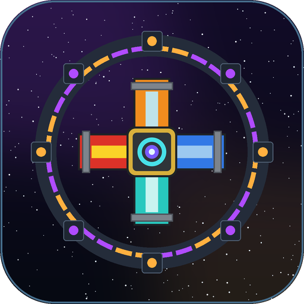
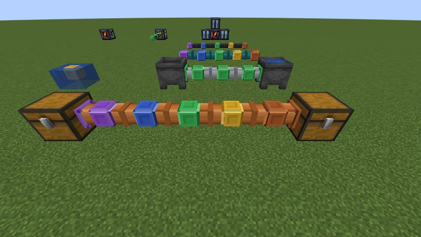
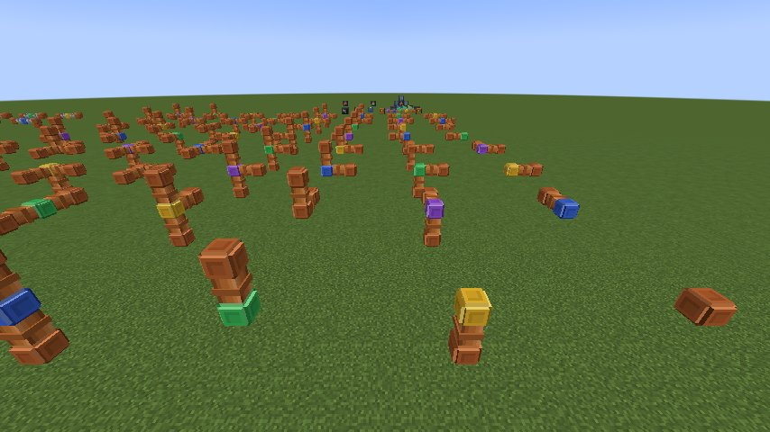
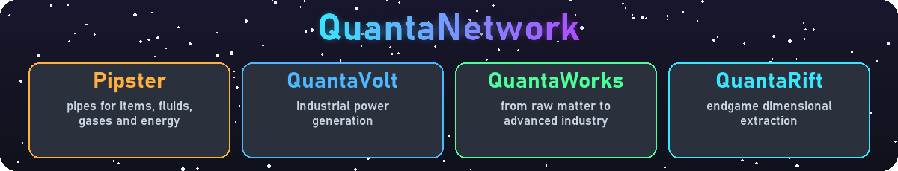

  

<h1 align="center">Pipster</h1>

  Readable item, fluid, gas and energy pipes for Minecraft, with filters right at the port, 
  channel-based tesseracts and the Energy Pulse Amplifier. For Fabric and NeoForge.

  <a href="#downloads">Download</a> ·
  <a href="#version-status">Versions</a> ·
  <a href="../../wiki">Wiki</a> ·
  <a href="#part-of-the-quantanetwork">QuantaNetwork</a> ·
  <a href="api/README.md">API for mod developers</a> ·
  <a href="#license">License</a>

> **Version 1.3.0.** For Minecraft 1.21.1, 1.21.11, 26.1.2, 26.2 and 26.3 on Fabric and NeoForge; see
> [Version status](#version-status). New: a new look for all pipes and cables (the tube shows the kind, the
> node and flange show the tier), and the port screen's status line now updates while it is open. Worlds from
> 1.2.0 load without changes, and mods built against the Pipster API keep working. For other Minecraft
> versions, Pipster 1.2.0 stays available.

This repository holds the documentation, the [wiki](../../wiki), the [issue tracker](../../issues) and the
[API for mod developers](api/README.md). The mod itself is downloaded from Modrinth or CurseForge. Pipster is not
open source; see [License](#license).

Pipster is a transport mod that tries to stay easy to read. Every resource type has its own pipe, every pipe looks
like a pipe (no full blocks), and everything you configure lives directly at the port where the pipe meets a machine.

* **Four transport kinds:** item pipes, fluid pipes, gas pipes and energy cables. Different kinds never connect to
  each other.
* **Five tiers:** Copper, Reinforced, Precision, Resonant and Quantum, plus the Singularity tier for energy cables.
  Upgrade pipes in place with an upgrade bolt; the pipe keeps its settings and contents.
* **Configure ports with the Conduit Wrench:** mode, redstone control, priority, distribution and copy/paste
  profiles.
* **Filter cards instead of filter blocks:** put a card into the port itself.
* **Tesseracts:** send resources through named channels, in one dimension or across all of them.
* **Overcharge:** the Energy Pulse Amplifier stores energy and releases it in short, powerful pulses.
* **Honest throughput:** every pipe segment has one shared per-tick budget. A single Copper segment limits a whole
  path, even between Quantum ports. Nothing ignores limits: even the creative-only energy cable has a finite rate,
  and a thinner cable between two of them keeps its own limit.

**How to recognise them (new look in 1.3.0):** the tube shows the kind, the node and the flange show the tier.

* **Item pipe:** square copper tube. **Fluid pipe:** round iron-grey tube. **Gas pipe:** round petrol (dark teal)
  tube. **Energy cable:** narrower square anthracite cable with fine insulation rings.
* The **node** is the chamfered cube in the middle; it and the flange have the tier colour (table below).
* A **flange with four bolts** only where a pipe meets a machine; between two pipes a slim coupling; open sides show
  only the node. Pipes stay narrow, never full blocks, and the hitbox follows the pipe.
* Throughput, tiers, recipes and behaviour did not change with the new look.

Rates are per pipe segment and tick, shared by all transfers through that segment. They are balance values, not
measured results.

| Tier | Node and flange | Items/t | Fluid mB/t | Gas units/t | Energy E/t | Item batch |
|---|---|---:|---:|---:|---:|---:|
| T1 Copper | copper | 2 | 100 | 100 | 1,000 | 8 |
| T2 Reinforced | gold | 8 | 400 | 400 | 8,000 | 32 |
| T3 Precision | emerald green | 32 | 1,600 | 1,600 | 64,000 | 64 |
| T4 Resonant | lapis blue | 128 | 6,400 | 6,400 | 512,000 | 256 |
| T5 Quantum | amethyst purple | 512 | 25,600 | 25,600 | 4,096,000 | 1,024 |
| T6 Singularity (energy only) | redstone red | – | – | – | 32,768,000 | – |
| Supercalifragilisticexpialidocious Energy Cable (creative only) | magenta, white bolts | – | – | – | 1,000,000,000,000 | – |

* **Singularity Energy Cable (since 1.2.0):** eight times the Quantum cable, energy only. Upgrade Quantum Energy
  Cables with a Singularity Upgrade Bolt or by crafting.
* **Supercalifragilisticexpialidocious Energy Cable (since 1.2.0):** creative mode only. No recipe, no upgrade path,
  and it drops nothing when broken (energy buffered in it is lost). Machines of other mods still decide how much
  they accept.

* **Right-click a port:** mode (insert, extract, both, off), redstone control, priority, distribution (round robin,
  nearest first, sticky). The status line says why nothing moves, for example "Machine only gives: set this port
  to Extract". Since 1.3.0 it updates while the screen is open.
* **Accept port (new in 1.1.0):** a side next to a block that pushes but offers no storage of its own (AE2 Export
  Bus, Create funnels, Oritech item and fluid pipes) can be set to **Accept**. It takes what the block pushes in and
  never pulls.
* **Sneak + right-click an arm:** disconnect just that side; the same on the centre reconnects it, elsewhere it
  dismantles the pipe.
* **Copy and paste** port settings with 3 profiles. Cards are never copied.

| Card | Rules | What it can do |
|---|---:|---|
| Basic | 9 | exact item, fluid or gas; allowlist or denylist |
| Advanced | 27 | tags, whole mods, exact components such as enchantments |
| Precision | 54 | also "keep N in the source" and "fill the target up to N" |
| Rule Card | – | per-port rate limit and energy reserve |

Patterns are ghost items: nothing is used up.

**Since 1.2.0:** fluid and gas pipes have a filter field with suggestions. Type a name or an id and pick a fluid,
gas or (with Mekanism on NeoForge 1.21.1) chemical from the list; no filled container needed. `#` lists the tags of
the pipe's type, "Everything from <mod>" covers a whole mod, and entries with the same name show their mod in
brackets. The server checks that every entry fits the pipe.

* **Resonant Tesseract:** any distance in the same dimension, T4 speed.
* **Quantum Tesseract:** all dimensions of a server, T5 speed.
* One channel per resource type per tesseract, private, invite-only or public, filters per side. A transfer uses at
  most one tesseract jump.

The **Energy Pulse Amplifier** is a buffered pulse source. It takes energy evenly, stores it at **90 % efficiency**
and releases it for a short time at a higher rate than it takes. It never creates energy: more output than input is
only possible while the store lasts.

* **Front = output**, every other side = input. The amplifier pushes into the cable at its front and respects that
  cable's budget, so a thin cable limits the pulse. On Singularity and creative cables its own pulse limit applies.
* **Capacitor Banks** next to it (or next to another bank of the group) add capacity and pulse power, up to 8 banks.
  A bank group that touches two amplifiers counts for neither.
* **Modes:** Auto (gives whenever something takes), Charge (gives nothing), Pulse (full power while fired by
  redstone or the Fire button; starts from 10 % charge, after an empty pulse only again when Ready).
* **Screen:** stored and capacity, input and output per tick, efficiency, banks, pulse limit, mode, target and status
  (Charging, Ready, Pulsing, Empty).
* **Looks and sounds:** the coil turns faster with the charge and very fast during a pulse, glowing, with sparks;
  charge lights on the pillars; sounds for activation, hum, ready, pulse and wind-down.
* Breaking it keeps the stored energy in the item; creative pick-block never copies it.

| Default value (server config) | |
|---|---:|
| Store of the amplifier | 1,000,000 E |
| Per Capacitor Bank | +1,000,000 E |
| Input | 16,000 E/t |
| Pulse limit | 32,000 E/t + 4,000 E/t per bank |

1 E = 1 FE = 1 Team Reborn Energy unit. Full pulse power needs at least a Precision cable.

* Everything is decided on the server. Clients only see pipe shapes and the screen data they are allowed to see.
* Every screen action is checked on the server: session, distance, build permission, tesseract channel access, and
  a revision number so stale screens cannot overwrite newer settings.
* Tesseract channels only work while all involved chunks are loaded. Pipster never loads chunks on its own.
* Creative pick-block never copies buffered resources, filter cards or stored energy.
* Server settings live in `config/pipster-server.properties` (see the [wiki](../../wiki/Configuration)).

Pipster belongs to the **QuantaNetwork** by cptgummiball:

* [Pipster](https://github.com/CptGummiball/Pipster): readable pipes for items, fluids, gases and energy.
* [QuantaVolt](https://github.com/CptGummiball/QuantaVolt): industrial power generation.
* [QuantaWorks](https://github.com/CptGummiball/QuantaWorks): from raw matter to advanced industry.
* [QuantaRift](https://github.com/CptGummiball/QuantaRift): endgame dimensional extraction.

The mods work together through public, standard interfaces. Pipster itself needs none of them.

Pipster talks to other mods through the standard interfaces of each loader. It has no hard dependency on any
content mod.

| Resource | Fabric | NeoForge |
|---|---|---|
| Items | Fabric Transfer API | NeoForge item capability |
| Fluids | Fabric Transfer API | NeoForge fluid capability |
| Energy | Team Reborn Energy (included) | NeoForge energy capability |
| Gas | Pipster gas API, plus fluids tagged `#pipster:gaseous` | Pipster gas API, fluids tagged `#pipster:gaseous`, Mekanism chemicals (1.21.1) |

Mod developers find the exact interfaces per version in the [API documentation](api/README.md).

**Tested with the real mods** (dedicated server, client and all game tests; the game tests also send items, fluids
and energy through real blocks of these mods and back, and check that nothing is lost or created). The table shows
the runs with the 1.3.0 files (release check 2026-11-08; same result as 1.2.0 on these Minecraft versions).

| Mod | Where | What is checked |
|---|---|---|
| Storage Drawers | all five versions, both loaders | drawers and compacting drawers (no duplication) |
| Sophisticated Storage | NeoForge, all five versions; Fabric 1.21.1 (unofficial port) | barrels |
| Energized Power | all five versions, both loaders | battery box, fluid tank |
| Oritech | 1.21.1 both loaders; NeoForge 26.1.2 (beta) | energy storage, tank |
| Powah! | NeoForge 1.21.1; 26.1.2 (alpha) | energy cell |
| Mekanism | NeoForge 1.21.1 | energy cube, fluid tank, chemicals through gas pipes |
| Create | NeoForge 1.21.1 | fluid tank, Mechanical Arm targets item pipes |
| Applied Energistics 2 | NeoForge 1.21.1 (with Applied Mekanistics), 26.1.2 – 26.3 | starts and runs together |
| Immersive Machinery | 1.21.1, 26.1.2, 26.2, both loaders | starts and runs together (it has no blocks to connect) |

"Where" lists the Minecraft versions on which the run was made. That is not a promise that every mod or every block
works; please [report problems](#reporting-bugs).

What else to know:

* **Mekanism chemicals** (NeoForge 1.21.1): gas pipes move hydrogen, steam, sodium, coolants, fuels and waste.
  Radioactive chemicals are released like Mekanism does when a pipe is broken and never travel in the item.
* **Fabric energy:** ports in Extract or Both actively pull energy (config `fabricEnergyPull`, on by default), so
  generators that push to the wrong side or not at all still work.
* New energy ports next to a block that only gives start in Extract mode. Saved ports never change.
* Datapack tags: `pipster:energy_no_insert` (never push energy into these blocks, e.g. Powah reactor parts) and
  `pipster:extract_warning` (warn when an extract port could pull storage media out of a drive).

### Built-in optional integrations

These mods are **never required**. Install them and Pipster uses them; without them nothing changes. Each
integration is included for the Minecraft versions where the other mod has a release (see the
[wiki](../../wiki/Supported-Versions#integrations)).

| Mod | What you get |
|---|---|
| [Jade](https://modrinth.com/mod/jade) | Look at a pipe, tesseract or pulse amplifier: port mode and status, bound channels (names only if you have access), charge and status. |
| [CC: Tweaked](https://modrinth.com/mod/cc-tweaked) | Computers read pipes, tesseracts and pulse amplifiers. With the redstone mode "Computer" they can switch ports. |
| [Open Parties and Claims](https://modrinth.com/mod/open-parties-and-claims), [FTB Chunks](https://www.curseforge.com/minecraft/mc-mods/ftb-chunks-forge) | Claim protection: pipes cannot pull from or push into blocks in someone else's claim. |
| FTB Teams, Open Parties and Claims parties | Team sharing: teammates share channels, tesseracts and pipes, also for things placed before they joined. |
| LuckPerms and other permission mods | Permission nodes `pipster.admin` and `pipster.command`. Without a permission mod, operators (level 2) keep these rights. |
| Create | The Mechanical Arm can target item pipe sides (NeoForge 1.21.1). |
| Mekanism | Chemicals through gas pipes (NeoForge 1.21.1). |

The Conduit Wrench is also tagged `c:tools/wrench`, so other mods recognise it as a wrench.

Pipster 1.3.0 has one jar per Minecraft version and loader; no jar covers several Minecraft versions.

| Minecraft | Fabric jar | NeoForge jar |
|---|---|---|
| 1.21.1 | `pipster-1.3.0+mc1.21.1-fabric.jar` | `pipster-1.3.0+mc1.21.1-neoforge.jar` |
| 1.21.11 | `pipster-1.3.0+mc1.21.11-fabric.jar` | `pipster-1.3.0+mc1.21.11-neoforge.jar` |
| 26.1.2 | `pipster-1.3.0+mc26.1.2-fabric.jar` | `pipster-1.3.0+mc26.1.2-neoforge.jar` ¹ |
| 26.2 | `pipster-1.3.0+mc26.2-fabric.jar` | `pipster-1.3.0+mc26.2-neoforge.jar` ¹ |
| 26.3 | `pipster-1.3.0+mc26.3-fabric.jar` | `pipster-1.3.0+mc26.3-neoforge.jar` ¹ |

¹ Needs at least NeoForge 26.1.2.122, 26.2.0.93 or 26.3.0.97 (since 1.1.0; current partner mods need these builds).

**Other Minecraft versions** (1.21.2 – 1.21.10, 26.1, 26.1.1): use Pipster 1.2.0. It stays available and keeps
working. Builds for further versions only come back if enough players ask for them in the
[issue tracker](../../issues).

Before a jar is released, it is tested on its Minecraft version: client and dedicated server started, and all
automated game tests (item, fluid, energy and gas transport, throughput limits, filters, tesseracts, the pulse
amplifier, claims and teams, break/place with stored contents, save/load, network packet checks), plus runs with the
integrations and partner mods above wherever those exist.
All ten 1.3.0 files passed this release check on 2026-11-08: 188 runs passed, none failed; 12 runs could not take place for reasons outside Pipster (Open Parties and Claims cannot start on a game-test server and is checked on the dedicated server instead; CC: Tweaked 1.120.3 does not start on NeoForge 26.3).
The exact loader versions are listed in the wiki under [Supported Versions](../../wiki/Supported-Versions).

Pipster does no work per pipe per tick. It keeps one transport graph per dimension and resource type on the server,
rebuilds it in bounded steps, and never loads chunks.

**1.3.0 was not measured again:** it only changes models, textures and the refresh of the port screen; the transport
code did not change in a way that matters for performance. All numbers below were measured with older versions.

Measured for 1.1.0 on an Intel Core i7-13700H (dedicated server, Minecraft 1.21.1 and 26.3, both loaders):

| Scene | Pipster time per tick (p95) |
|---|---|
| 10,000 idle pipes | about 0.01 ms |
| 10,000 pipes, 100 active ports | 0.8 – 1.2 ms |
| 50,000 pipes, 500 active ports | 3.4 – 5.0 ms |
| network that splits and merges every second | 0.02 – 0.07 ms |

**1.2.0 compared with 1.1.0** (same machine, 50,000 pipes with 500 active ports, both versions in alternating runs):
8 to 11 % less time per tick on 1.21.1 (both loaders) and 26.3 Fabric, no measurable change on 26.3 NeoForge, and
less than half the memory per tick on 1.21.1 Fabric. Details in the wiki under [Performance](../../wiki/Performance).

These numbers hold for that machine and those scenes only. They are no guarantee of 20 TPS on other hardware or in
other worlds. The method is described in the wiki under [Performance](../../wiki/Performance).

* [Modrinth](https://modrinth.com/project/pipster)
* [CurseForge](https://www.curseforge.com/minecraft/mc-mods/pipster)

Please download Pipster only from these pages. Pick the file for your exact Minecraft version and loader. The
[wiki](../../wiki) explains how to play, recipes, tesseracts, the pulse amplifier, configuration and the FAQ; the
[API documentation](api/README.md) covers gas handlers, endpoint providers and the CC: Tweaked methods.

Please open an [issue](../../issues/new/choose) with:

* Minecraft version, loader (Fabric/NeoForge) and loader version
* the Pipster jar name (it contains the Pipster and Minecraft version)
* the other mods involved, if the problem is with a specific machine
* `logs/latest.log`, and a crash report if there is one

Pipster is **not open source**. All rights reserved by cptgummiball; see [`LICENSE`](LICENSE). In short:

* You may play with Pipster, use it on any server and show it in videos and streams.
* You may put Pipster into **modpacks**, as long as the jar files stay exactly as published.
* You may **not** modify, decompile, re-upload or otherwise redistribute Pipster, or use its textures, models and
  sounds elsewhere.
* Mod developers may compile against the [Pipster API](api/README.md) to make their mods work with Pipster.
* For anything else, open a [permission request](../../issues/new?template=permission_request.yml).

Pipster is made by **cptgummiball**. It is inspired by the readability of classic pipe mods, but contains no code or
assets from other mods. Pipster is not an official Minecraft product and is not associated with Mojang or Microsoft.
